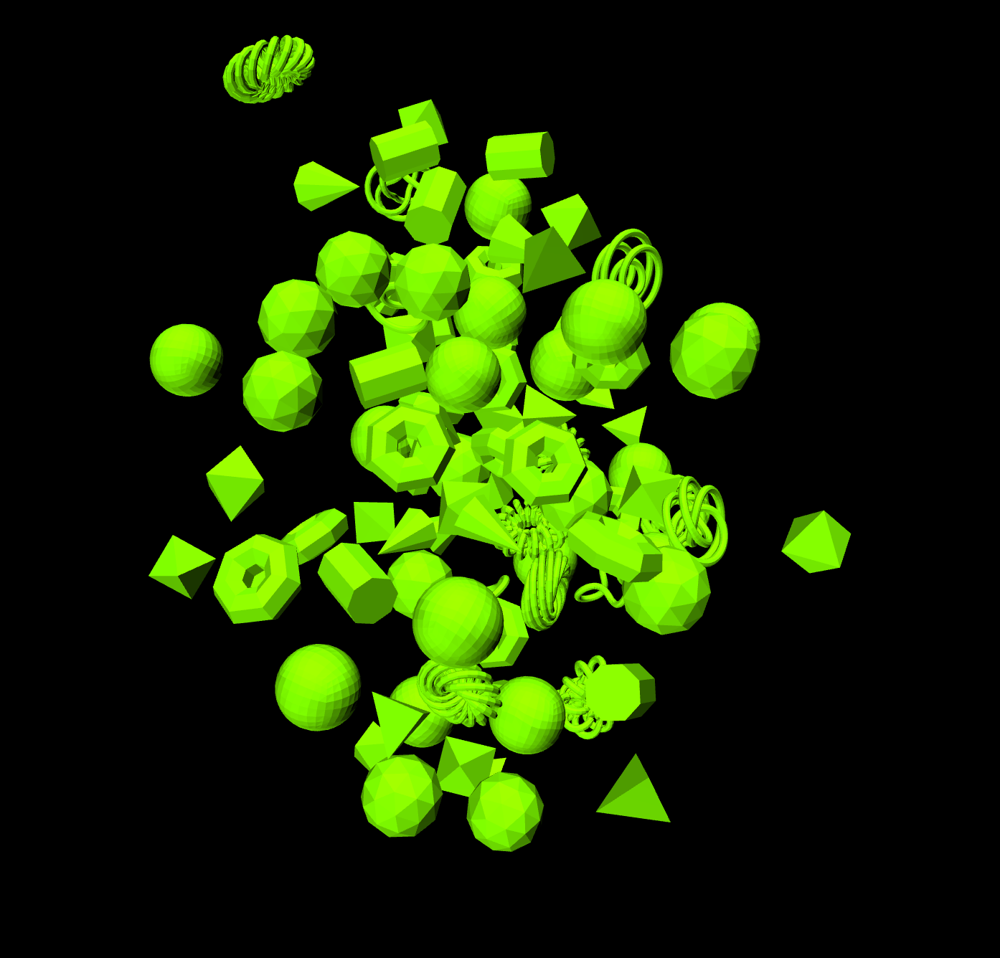
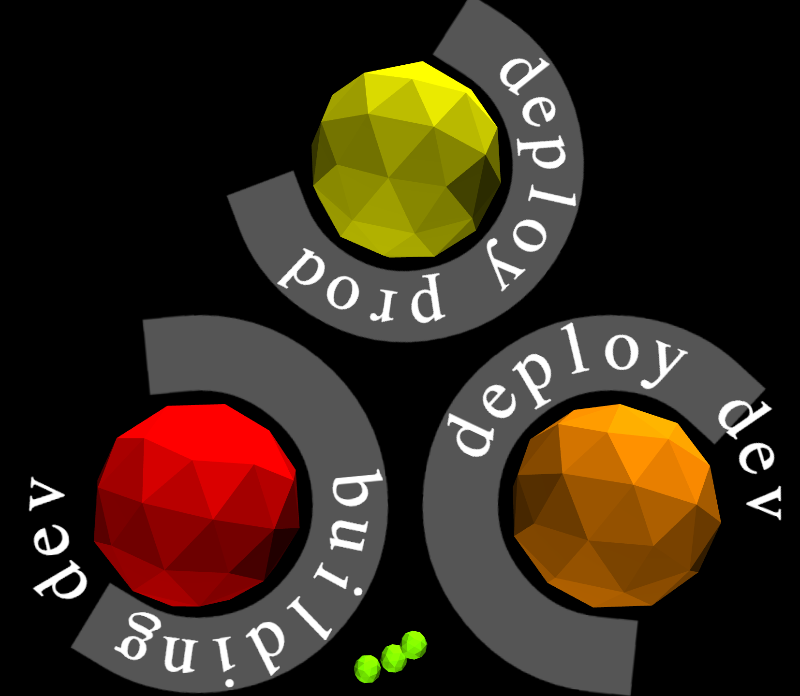

# Balls

If you want a build monitor/radiator, it should be worth looking at.

Build monitors needs to be fun. Anyone can develop plain old html/css grid based view, play sounds etc.
That stuff is like flash, old and needs to be replaced.

Put this monitor on a TV, and you will never go back to any other monitor.
A word of caution: You will find this radiator hard to look away from and may not be able to focus on your work.

### Screenshots

### Setup without server side config

	1. lein ring server
	2. launch browser at <hostname>:3000
	3. Setup config right there.

	Since the config is UI based, different teams have full control over their configuration.

### Setup with server side config

	1. Copy config.json.sample to config.json under resources/config.
	2. Set url, include/exclude regex.
	2. lein ring server
	3. launch browser at <hostname>:3000

	You cannot override cctray url. You can still do custom include/exclude from browser.

### Sounds

We love sounds. Sounds are played at 2 different event.

	1. When the build breaks.
	2. When the build succeeds after it breaks.

To have custom sounds:

	1. Copy your audio file(s) in resources/sounds folder. No need to restart the server.
	2. Reload page.
	3. Select audio in UI controls.

### Ball Colors

1. Green is healthy.
2. Yellow is building.
3. Red is broken.
4. Orange is building after being Red.

### UI Controls

1. Sound selection when build goes Red.
2. Sound selection when build goes from Orange to Green.
3. Toggle text rotation.
4. Attraction/Repulsion for all the green balls.

### Supported CI Servers

1. GO

### Known issues

1. If webgl is not supported by browser/machine, it will not work.
   Use [nevergreen](https://github.com/build-canaries/nevergreen).

2. Local storage is required to save your config and UI controls.

### License

Distributed under the Eclipse Public License.